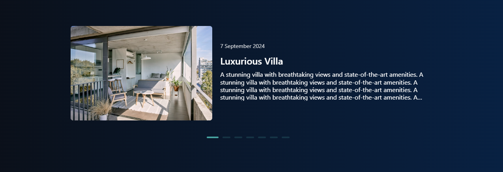

# Issues - 

- [x] Fix Allignment 1

- [x] Add more horizontal padding

- [x] Center align pagination component

- [x] why are the values not in same line as their heading?

- [ ] make all btns consistent with 10px border radius design - RISHAB

- [ ] controllers missing - SOUMYAJIT
  

- [ ] Make all headings consistent. Make a .heading and .sub-heading class in index.css and apply those classes everywhere - RISHAB

- [ ] Sorting in the table - SOUMYAJIT