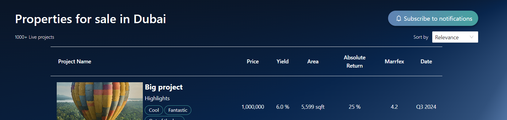
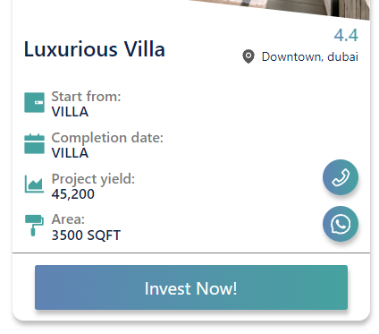

# Issues - 

- [ ] Fix Allignment 1

- [ ] Add more horizontal padding

- [ ] Center align pagination component

- [ ] why are the values not in same line as their heading?

- [ ] make all btns consistent with rpm border radius design
- [ ] just testing git